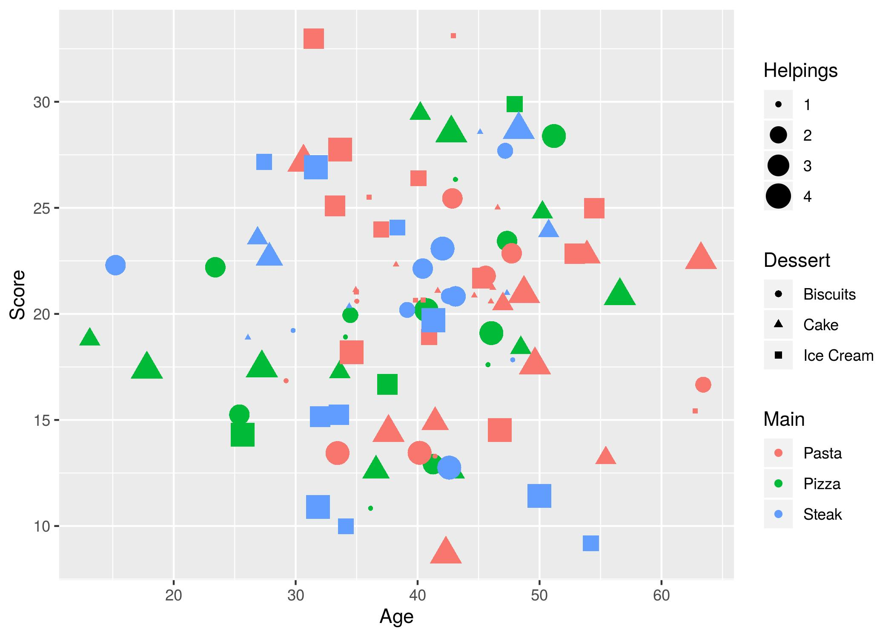
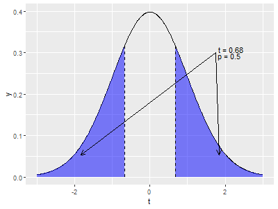

```{r setup, include=FALSE}
library(tidyverse)

```

# New Functions

Let's learn a a few more useful functions (that I should have covered previously). I'll keep these functions here in this set of notes for now, but by next week, I'm going to migrate them back into the previous lessons.

## The rep() function

We've learned that the `c()` function can be used to create simple vectors. We can also use it to stick multiple vectors together.

```{r}
x <- c(1,2,3)
y <- c(4,5,6)

c(x,y)
```
Another function we can use to create larger vectors is the `rep()` function. This function will repeat a value a certain number of times (without the need to write it our that many times in a `c()` function).

```{r}
c("a","a","a","a","a","a","a","a","a","a")

rep("a",10)
```

These two methods create the same vector, but the first is succeptible to being mistyped (i.e. we  might put the wrong amount of "a"s). We can also repeat vectors in two different ways:

```{r}
x <- c("a","b")

rep(x,10)

rep(x,each=10)

```

## The tibble() function

When we've loaded data into R using the `tidyverse` function `read_csv()`, it gets brought in as a tibble. We can also create a tibble in R using the `tibble()` function.

Remember that R views a tibble as a set of vectors, where each variable (column) within the tibble is a seperate vector and we can use the `$` operator to access them. We construct a tibble in the same way:

```{r}
tbl <- tibble(x = 1:10,
              y = rep("hello",10))
tbl
```

### The tribble() function

This method for creating a tibble within R is obviously useful, but if we're entering data into our tibble by hand, we can run into problems with trying to make sure our data-points (i.e. our rows) are lined up correctly. The `tribble()` function solves this by allowing us to enter our data in a more table-like way.

```{r}
tibble(x = c(  1,   2,   3),
       y = c( 12,  13,  14),
       z = c("a", "b", "c"))

tribble(~x,  ~y,   ~z,
         1,  12,  "a",
         2,  13,  "b",
         3,  14,  "c")
```

## The sample() function

The `rxxx()` functions are great for generating random numbers that follow a certain distribution, but sometimes we want to generate random categorical data. For this, we can use the `sample()` function.

```{r}
cat.set <- c("red","blue","green","yellow","orange","purple","brown","black","white")
sample(cat.set,5)
```
The first argument is our set of values that we want to pick from, and our second argument is the number that we want to take. This is similar to the probability problems from high school: "We have a bag with 6 red balls and 7 yellow balls, you pull out 5 balls", etc...

If we want to pick the values with replacement, we can specify this with the `replace` argument. This can allow us to draw out the colour `"red"` more than once in our output, and if the `size` of our sample is bigger than our set of values, then we *need* to specify this (R doesn't assume this by default so it will throw an error otherwise).

```{r}
c("red","blue") %>%
  sample(10,replace=T)
```

# The ggplot2 package

One of the most pleasing packages that comes with the `tidyverse` is the `ggplot2` package. This is at the core of plotting within the `tidyverse`. As with anything else in R, there are other package that can plot that are built on top of the `ggplot2` package. Once we learn the core style of `ggplot2`, you'll be able to transfer that knowledge.

## The ggplot() function

Previously we made plots using the `plot()` function, which takes an `x` and `y` and plots them together. Pretty intuitive. For `ggplot()`, our data needs to be organised into a tibble (or a data.frame) for us to actually plot it. This is why we're going to need the `tibble()` function, because our data needs structure before we can `ggplot()` it.

The `ggplot()` function basically just starts us off. Like grabbing a blank canvas. We'll then add **layers** to our canvas using other functions. Try running `ggplot()` on it's own and you'll see that it clears the **Plots** tab in our **Viewer** pane.

## The aes() function

There are lots of different aspects of a plot that we can change and personalise. This includes the values that we're going to put along the x- and y-axis. In `ggplot2`, we call these things `aesthetics`. We use the `aes()` function to map variables in our dataset (a tibble or a data.frame) to these aesthetics:

```{r}
aes(Score_1,Score_2,col=Score_3)
```

Notice that we haven't provided any data to `aes()`. We've just provided it with some variable names (without quotes). When we *do* tell `ggplot2` what our data is, it will automatically piece it all together based on these mappings. Also note that `aes()` assumes the first two arguments are `x` and `y` (unless otherwise stated). Convenient.

Now, whenever we want to do something with our data in `ggplot2`, we use these `aesthetics`, rather than the original variable names.

## The geom_point() function

So now `ggplot2` knows what our variables are called, so let's tell it how we want to display our variables. The simplest plot we can do is a `geom_point()` plot, which gives us a scatter plot. Remember, we start with  blank canvas `ggplot()` and then add our `layers` to it.

`r set.seed(97310)`
```{r}
n <- 50
dat <- tibble(Score_1 = rnorm(n),Score_2 = rnorm(n), Score_3 = rnorm(n))

ggplot(dat,aes(Score_1,Score_2)) + 
  geom_point()
```

In this code, we defined our data and our aesthetics in the `ggplot()` function. This means that we're going to use the same data and aesthetics for each layer, but we can specify either the data or the aesthetics for an individual `layer`, and we can specify aesthetics separately.

```{r}
ggplot(aes(x=Score_1),data=dat) + 
  geom_point(aes(y=Score_2),col="red") + 
  geom_point(aes(y=Score_3),col="blue")

```

We can also define aesthetics to be separate from the data. In the above example, we defined `col` (or colour) to be a constant for each layer individually. Therefore, this is a static aesthetic (since it doesn't change) as opposed to a dynamic aesthetic (different for each data point).

## The geom_line() function

The previous function allowed us to plot a scatter plot. Nice and basic. Obviously, there are plenty of other kinds of plots we might want to create. The key aspects of these functions stays the same, but we can change what the type of plot is by changing what comes after the `geom_*`

```{r}
dat_lin <- tibble(Score_1 = seq(-3,3,length.out=20),
                  Score_2 = Score_1+rnorm(20,sd=0.3))

ggplot(aes(x=Score_1,y=Score_2),data=dat) +
  geom_point(col="red") +
  geom_line(data=dat_lin)
```

Notice that here, we have specified that the data in our `geom_line()` function is acutally going to come from a different dataset to our `geom_point()` function. By default, the functions will use the data and aesthetics defined in the `ggplot()` function, but we can override that if we want to add more to our plots.

It's also important to remember that `ggplot2` is adding the layers to our canvas *in order*, so sometimes we may end up with a layer being *over* another.

## The geom_histogram() function

If we have a single variable and we want to see it's distribution, the most common way to do this is through a histogram and, of course, `ggplot2` has a histogramming function:

```{r}
p <- ggplot(dat, aes(Score_1)) +
  geom_histogram(aes(y=..density..),binwidth=0.2,fill="red")

p
```

Note that here, we actually stored our plot as a *variable*, `p`. This can be useful if you want to experiment with different styles in your plot without having to re-write the whole `ggplot()` command. We also supplied the `x` aesthetic (`Score_1`), which is what we're counting and the `y=..density..` aesthetic. This tells `ggplot2` to show the density of the bins, rather than the count data.

We're also passing two other arguments to the `geom_histogram()` function. The `binwidth=0.2` tells `geom_histogram()` how wide we want each of these bins to be. There are various other ways we can define this and by default `geom_histogram()` will create 30 equally spaced bins. The `fill` argument tells `geom_histogram()` what colour to *fill* the bars in, whereas the `col` argument used earlier would tell `geom_histogram()` what colour to draw the border of our shapes.

## The geom_density() function

Creating a histogram is a nice way to see the distribution, but we can add a smoother version of a histogram using `geom_density()`, which essentially smooths out this distribution to look more like our classic density functions which define our pdfs:

```{r}
p + geom_density()
```

## The geom_bar() function

The histogram cuts our x-axis into bins and count how many values are in each of these bins. If we're using categorical variables, we need a bar chart rather than a histogram.

`r set.seed(34632)`
```{r}
c("dog","cat","fish") %>%
  sample(30,replace=T) %>%
  tibble(cat=.) %>%
  ggplot(aes(cat)) + 
  geom_bar(aes(fill=cat))
```

Notice that we have integrated our `ggplot()` function with the `%>%` to funnel our transformed dataset directly into our plot, and then added on the layers as normal. This is why `ggplot()` takes the dataset as it's first argument.

## Long vs Wide

In the previous lesson we briefly touched on the `gather()` and `spread()` functions as a way to convert between **Long** and **Wide** formatted data. Let's take a look at two different ways to plot the same data:

`r set.seed(4219)`
```{r}
n <- 20
dat_lin <- tibble(time = 1:n,
                  Score_1 =     time + rnorm(n),
                  Score_2 = 0.3*time + rnorm(n),
                  Score_3 = 1.2*time + rnorm(n,sd=0.3),
                  Score_4 = 0.5*time + rnorm(n,sd=0.3),
                  Score_5 =   2*time + rnorm(n,sd=0.3))

ggplot(dat_lin,aes(x=time)) +
  geom_line(aes(y=Score_1),col="black") +
  geom_line(aes(y=Score_2),col="red") +
  geom_line(aes(y=Score_3),col="blue") +
  geom_line(aes(y=Score_4),col="orange")+
  geom_line(aes(y=Score_5),col="purple")

```

Here, our data is in a **Wide** format, meaning we have a separate column for each of our variables. The code above works okay, but if we have a lot of these variables in our wide format, then we'd be typing the same code repeatedly and creating a new layer for each variable (and we made run out of colours to come up with!)

```{r}

dat_lin %>%
  gather(-time,key="Score.Num",value="Score") %>%
  ggplot(aes(x=time)) +
  geom_line(aes(y=Score,group=Score.Num,col=Score.Num))
```

This method bypassess the need to come up with our own colours for our lines (`ggplot2` has some built in methods of picking colours) and also provides a legend along the side to tel us what each colour means.

## The geom_ribbon() function

In statistics, we're never sure that an estimate is exact, and so a common thing that we would do is to estimate it within some sort of boundary. If we have these bounds, we can use them in a plot:

`r set.seed(11039)`
```{r}
dat <- tibble(time = 1:20,
              Score = time + rnorm(20),
              Error = runif(20,0,1))

dat %>%
  mutate(Upper = Score + Error,
         Lower = Score - Error) %>%
  ggplot(aes(x=time)) + 
  geom_line(aes(y=Score),col="red") + 
  geom_ribbon(aes(ymin=Lower,ymax=Upper),col=NA,fill="red",alpha=0.2)

```

In the above plot, we used a static aesthetic called `alpha`, this defines how transparent our ribbon is and means that we can still see the other layer below it (remember `ggplot2` plots the layers in order).

Worth noting that we don't necessarily have to define the confidence intervals before plotting the data. We can pass calculations as aesthetics.

```{r}
ggplot(dat,aes(x=time)) + 
  geom_line(aes(y=Score),col="red") + 
  geom_ribbon(aes(ymin=Score-Error,ymax=Score + Error),col=NA,fill="red",alpha=0.2)
```

## Zooming

By deafult, `ggplot2` will figure out what the range of values your data is using and create the plot accordingly to include all of your data. However, sometimes this is not idea

`r set.seed(73910)`
```{r}
n <- 30
dat <- tibble(time = 1:n,
              Score = rnorm(n))

#Let's deliberately add in an outlier
dat$Score[15] <- 100

p <- ggplot(dat,aes(time,Score)) +
  geom_line() 

p
```

See, all of the data is really clumped together and it makes it hard to see because of that one outlier, `ggplot` tries to plot everything. We can use `ylim()` or it's counterpart, `xlim()` to zoom in on the region that we only way to consider.

```{r}
p + ylim(-3,3)
```

This view creates a cut along our line. If we were plotting points, this would be fine or if we *did* want to omit the outlier, it would work okay. But what if we just want to zoom in, but keep the outlier off-screen? We use `coord_cartesian()` to do this.

```{r}
p + coord_cartesian(ylim=c(-3,3))
```

The graph is essentially the same, but we've zoomed in and the lines still all connect.

## Labelling

Up until now, we've been plotting pretty plain views of the data, however we'd usually want our plots to be clear about what they're showing:
`r set.seed(413430)`
```{r}
n <- 40
dat <- tibble(yr = 1970 + 1:n,
              v = rnorm(n))

p <- ggplot(dat,aes(yr,v)) + 
  geom_line()

p + labs(title="Change over time",
         subtitle = "Right Here",
         x = "Year",
         y = "Score")
```

## Other aesthetics

We mentioned briefly that we could change the colour of our points, either as a static change (everything in the layer is the same) or based on a group. There are a few other aesthetics we can personalise as we like:

`r set.seed(9320)`
```{r}
n <- 100
dat <- tibble(Main = sample(c("Pizza","Pasta","Steak"),n,replace=T),
              Dessert = sample(c("Ice Cream","Cake","Biscuits"),n,replace=T),
              Helpings = sample(4,n,replace=T),
              Age = rnorm(n,40,10),
              Score = rnorm(n,20,5))

p <- ggplot(dat) + 
  geom_point(aes(x=Age,y=Score,col=Main,shape=Dessert,size=Helpings))

p

```

## The ggsave() function

So, we've made our beautiful plot. What do we do with it now? We need to be able to save it! the `ggsave()` function does just that
```{r}
ggsave("MyPlot.jpg",p)
```

Here is the saved image:



When we save, we can either do it as default

# Tests

We're now going to look at some of the common tests that we can perform in R. We're also going to use the opportunity to plot this data that we are testing to help us visualise what the tests are telling us (as well as practice using `ggplot2`)

## Hypothesis testing

When we are designing a statistical test, we will usually begin by expressing it as a Hypothesis Test. Within this context, we will have a **Null Hypothesis** and an **Alternative Hypothesis**. 

When we are running tests, we are trying to establish whether we have enough evidence in our data to *reject the Null*. Essentially, we believe (based on our data) that the Alternative Hypothesis is correct. In order to do this, we need to first establish the **Significance Level**, $\alpha$, at which we want to run our test. If we have a smaller significance level, our evidence to reject the Null will have to be stronger, and a higher significance will need weaker evidence. The significance level should be specified before you run any tests, commonly at 5%.

If we do not have enough evidence (i.e. our test does not pass our prespecified Significance Level), then we say that we have *failed to reject the Null*. This says nothing about whether or not we believe the Null or the Alternative hypothesis to be true, just that we don't have enough evidence to be sure.

### Sample vs Population

Remember, that the data we are looking at is only ever a **sample** of the truth. A **small** subset. For example, if we are looking at humans as our subjects and we have a sample of 7,000 humans (a big sample), that's still only 0.0001% of humans alive today. However, since we can never measure *everyone*, we'll have to use this sample to make inferences about the entire population.

Usually, we will use $\bar{x}$ to indicate the mean of our sample and $\mu$ to indicate the underlying population average. We can calculate the sample mean and assume it is close to the true (unknown) mean. We can also calculate how spread out our sample is with the standard deviation, $s$, and assume this is close to the population standard deviation, $\sigma$. (R will always calculate the *sample* standard deviation). For later notation, the size of our sample is $n$.

This can be seen in R using the `r***()` functions, we can specify a mean and a standard deviation, but the sample we generate will rarely perfectly match them:

```{r}
x <- rnorm(100,mean=0,sd=1)

mean(x)
sd(x)
```

## T-Test

Probably the simplest and most common statistical test is the T-Test. We first take a guess at what we think the population average is (usually backed up by research or assumptions), and then test to see if we believe this to be true, based on our data. If our guess at the average is 0, we can write this formally as:

$$ \begin{align*}
H_0&: \mu = 0\\
H_1&: \mu \neq 0\\
\end{align*}$$

Remember, we're trying to see if the *population* average is 0, based on the *sample* data. First, let's generate some data (with a mean that isn't 0) and then plot it to see what we it looks like.

`r set.seed(53547)`
```{r}
n <- 20
x <- rnorm(n,mean=0,sd=1)


ggplot(tibble(x),aes(x)) +
  geom_density() +
  geom_vline(xintercept=0,col="blue")+
  geom_vline(xintercept=mean(x),col="red")


```

To run a t-test, we need to assess how far away our *data* is from 0. Not just how far away our *average* is, but how far away the *data* is. Firstly, we calculate the t-statistic using the following formula
$$t = \frac{\bar{x}}{s/\sqrt{n}}$$

```{r}
t <- mean(x)/(sd(x)/sqrt(length(x)))
t
```

The denominator here, $\hat{\sigma}/\sqrt{n}$ is called the standard error of the data, sometimes just the *se*. This gives us an idea of how wrong our estimate of the average might be. We can see that if we have more data (larger $n$), our standard error will shrink. Alternatively, if our data is more clustered around a specific value (smaller $s$), the standard error will also shrink (because there is less uncertainty in our estimates).

What the t-statistic is measuring is how many standard errors our average is away from 0.

```{r}
#Get the data we need
x.bar <- mean(x)
x.s <- sd(x)
x.se <- x.s/sqrt(n)

t <- x.bar/x.se

#make a sequence from the mean to 0 at steps of the se
v.lines <- x.bar - (1:(t+1))*x.se

#Plot it all on a single plot
ggplot(tibble(x),aes(x)) +
  geom_density() +
  geom_vline(xintercept=x.bar,col="red") +
  geom_vline(xintercept=0,col="blue") + 
  geom_vline(xintercept=v.lines,linetype="dashed")  +
  annotate("text",x=x.bar,y=0.2,hjust=-0.3,label=paste0("t = ",round(t,3)))

```

We define our p-value to be the probability that we would get a t-statistic at least as big as the one we find, if our Null hypothesis were true. If the true underlying mean of our data were 0, we should get a small t-statistic because we would expect the average of our sample to be close to it as well. If our true underlying mean were far away from 0, we would expect a larger t-statistic. From the above definition of standard error, we also know that a larger sample size, $n$, would reduce our standard error and therefore increase our t-statistic and a smaller sample standard deviation, $s$, would increase our t-statistic. If $T$ follows a t-distribution, then

$$p = \textrm{Prob}\left(T > |t| \; \mid H_0\right)$$

Remember that in our pdf (probability density function), the area under the graph corresponds to the probability. As t changes, so does p:


We use the `pt()` function to get these p-values based on our t-statistic and our **Degrees of Freedom**. The degrees of freedom (df) of a dataset is essentially how much variability in the data can be attributed to the size/shape of the data, rather than the underlying structure of the data. More df means that the data is more flexible, and so we use a slightly different distribution depending on our df. For the t-distribution, $df = n-1$ and as df gets larger and larger, the t-distribution gets closer and closer towards the Normal distribution.

```{r}
t <- mean(x)/(sd(x)/sqrt(length(x)))
p.lower <- pt(-abs(t),df=n-1)
p.upper <- 1-pt(abs(t),df=n-1)

p <- p.lower + p.upper
p

```

If we defined our significance level, $\alpha$ to be 5%, then our p-value of `r round(p,4)` is lower than this threshold. If $p < \alpha$, we have strong evidence (as per our significance level) to reject the Null, and if $p > \alpha$, we do not have strong evidence to reject the Null. Therefore, in our example, we reject the Null.

So, we've manually calculated the p-value for our distribution. Is there an easier way than typing all the formula ourselves? Of course there is! R is a statistics software afterall:
```{r}
t.test(x)
```

The results provide all of the information that we've just calculated. It's a very convenient shortcut to working everything out ourselves. It also tells us what our alternative hypothesis is, which can be useful.

### Other T-Tests

There are a few other ways we can alter our t-test, without changing the underlying process involved.

#### Non-zero T-Test

In the above example, we tried to establish whether the underlying population average of our variable is different from 0.

$$ \begin{align*}
H_0&: \mu = a\\
H_1&: \mu \neq a\\
\end{align*}$$

We can define this with the argument `mu = a`.

```{r}
t.test(x,mu=1)
```

#### Paired T-Test

If we have a set of data with repeated measures, we would need to use a paired t-test. This means that we have measured the same outcome multiple times in each participant and we want to see if there has been a change.

$$ \begin{align*}
H_0&: \mu_A - \mu_B = 0\\
H_1&: \mu_A -\mu_B \neq a\\
\end{align*}$$

We can do this one of two ways, we can either calculate the change ourselves, or let the `t.test()` function do it for us.

```{r}
y <- x + rnorm(n)

z <- x-y
t.test(z)

t.test(x,y,paired=T)


```

We get the same results in both versions

#### One-sided T-Test

This type of test is much rarer that the others. In the previous version, we were trying to see if the population mean was different from a certain value (e.g. 0), however there are some circumstances where we want to know whether the population mean is specifically lower or greater than the value. This would be the case if we were trying to test non-inferiority (rather than tetsing for a difference)

$$ \begin{align*}
H_0&: \mu > a\\
H_1&: \mu \le a\\
\end{align*}$$

For this, we can tell R that we want to do a one-sided t-test:

```{r}
t.test(x,alternative=c("greater"))
```

The main difference is that earlier when trying to establish our p-value, we combined the two regions under the density function, in this case, we only need to use one of the regions because we do not care if our t-statistic is in the other region. This can be seen from the Confidence Interval having an upper limit of *infinity*.

This one-sided style of t-test can be combined with a different `mu` argument and as a paired t-test.

## Independent Two Sample T-Test

This is the main thing that we use a t-test for. We have a continuous variable, two groups and we want to compare the two groups. It's very similar to the above, except instead of comparing our average to a fixed value, we are comparing it to *another* average

$$ \begin{align*}
H_0&: \mu_A = \mu_B\\
H_1&: \mu_A \neq \mu_B\\
\end{align*}$$

Notice in the paired t-test, we were hypothesising that $\mu_A - \mu_B = 0$, which we could do for each participant because the measurements are paired. If our two measurements are independent, then we can't pair them in this way. A simple way we can convince ourselves of this is that the two groups can actually be different sizes (in which case we definitely can't pair them). For simplicity, I'm going to present the formula for the case when we have equal sizes (although this isn't necessary) and equal variances in the two groups:

$$t = \frac{\bar{x}_1 - \bar{x}_2}{\left.\sqrt{s^2_1 + s^2_2}\middle/{\sqrt{n}}\right.}$$
You can see the similarity between this and the regular t-test formula above. The big difference is that we calculate the standard deviation of the two samples combined as $\sqrt{s^2_1 + s^2_2}$. We then use this standard deviation to calculate the standard error in the same way as before.

Similar to before, this is measuring how many standard errors apart the two samples are. We'll visualise this, just like before:
```{r}
n <- 20
x <- rnorm(n,0,1)
y <- rnorm(n,1,1)

x.bar <- mean(x)
x.sd <- sd(x)
y.bar <- mean(y)
y.sd <- sd(y)
x.y.se <- sqrt(x.sd^2 + y.sd^2)/(sqrt(n))

t <- (y.bar - x.bar)/ (x.y.se)

v.lines <- y.bar - (1:(t+1))*x.y.se


ggplot() +
  geom_density(aes(x),data=tibble(x),col="red") + 
  geom_vline(xintercept=x.bar,col="red") + 
  geom_density(aes(y),data=tibble(y),col="blue") +
  geom_vline(xintercept=y.bar,col="blue") + 
  geom_vline(xintercept=v.lines,linetype="dashed") +
  annotate("text",x=y.bar,y=0.2,hjust=-0.3,label=paste0("t = ",round(t,3)))


```

This is also really easy to calculate in R using the `t.test()` function:
```{r}
t.test(y,x,var.equal=T)
```

Here, we specified to R that the variances are equal (because they are). If, however, we didn't know this, we would run a Welch's t-test, as opposed to the Student's t-test, which we have been running so far:

```{r}
t.test(x,y)
```

In this version, the t-statistic and the degrees of freedom are calculated differently and so we get a different p-value. This is why it's important to do the right tests for your data because the difference between the p-values could be enough to push across the significance level threshold and for you to come to the wrong conclusion about your data.

As with the simple case, we can alter our hypothesis for the t-test to look at only a one-sided t-test in the exact same way as above.

## Confidence Intervals

The `t.test()` function also provides a 95% confidence interval. This means that, based on our data, we are 95% sure that the true underlying population mean is somewhere in this interval. This is, once again, derived from the sample average and the standard error.

In the previous section, we used the t-statistic calculated from the data to get a p-value, by passing it into the `pt()` function, and compared this to our $\alpha$. For confidence intervals, we reverse this process. We choose a $p%$ to define our confidence level, commonly 95% is used (similar to the 5% significance level standard). We use this $p$ and pass it through the `qt()` to get a t-value. Note that the actual number we pass into `qt()` is $(1-(1-p)/2)$. this is because the area in the graph has to be $p%$, but it is split across the two regions (upper and lower). The $p%$ confidence interval is therefore:

$$\bar{x} \pm t \times \frac{s}{\sqrt{n}}$$
Don't forget that this t-value will depend on the degrees of freedom, and remember that $s/\sqrt{n}$ is the standard error.

If we lower our confidence requirement (i.e. we choose a lower $p%$), our t-value will be smaller, and therefore our confidence interval will be tighter. This is because we are less confident that it lies in this smaller range. Vice versa, if we increase our $p%$, we get a higher t-value and therefore wider limits because we need to be more confident.

From the t-test above:
```{r}
t.val <- qt(0.975,df=n-1)

#We use c(-1,1) to represent the plus or minus
x.bar + c(-1,1)*t.val*x.se

```

## Normality Testing

The above tests assumed that the data we were analysing (whether a single sample, or multiple samples) are Normally distributed. In most cases, this is a fine assumption to make. For example, the Central Limit Theorem states that if our sample is *big enough*, it will (almost always) follow a Normal distribution. The general rule of thumb is that a sample of at least 30 is enough for the CLT to start to apply. However, in smaller dataset, we might need to test if our data is Normal or not.

The above tests would not have been appropriate if our data weren't Normally distributed. If this is the case, we would need to use the **Non-Parametric** versions of these tests.

### The Q-Q Plot

Firstly, we can use a Q-Q plot (a quantile-quantile plot) to visualise whether our data looks like it follows a Normal distribution. We plot the quantiles of our data against their expected quantiles (if they were Normal).

`r set.seed(100)`
```{r}
n <- 20
x <- rexp(n)

ggplot(tibble(x),aes(sample=x)) +
  geom_qq() + 
  geom_qq_line()

y <- rnorm(1000)

ggplot(tibble(y),aes(sample=y)) +
  geom_qq() + 
  geom_qq_line()
```

We can see when the data is Exponentially distributed, there are quite a few points off the diagonal line. Whereas when the data is actually Normally distributed, they all follow quite closely.

This visualisation is great for seeing what's going on, but we need to formalise this as a test.

### Shapiro-Wilk Test

There are a few different ways to test for Normality, however the most commonly used is the Shapiro-Wilk Test and so that's what we will focus on today. As usual, we start with a Hypothesis:

$$ \begin{align*}
H_0&: X \sim N(\mu,\sigma^2)\\
H_1&: X \not\sim N(\mu,\sigma^2)\\
\end{align*}$$

Our Null Hypothesis is that the data is Normal and our alternative hypothesis is that it is not.
We run our test and if our results are significant (i.e. less than 0.05), then we'll conclude that our data isn't Normal and use the appropriate test for our data.

```{r}
shapiro.test(y)

```
Testing Normality for our Normal data gives a high p-value as we would expect.

```{r}
shapiro.test(x)
```

For our non-Normal data, we get a small p-value, and therefore we can assume (rightly) that this data is non-Normal. Therefore we would use the non-parametric version of our test.

## Wilcoxon Tests

The Wilcoxon tests are the non-parametric equivalent of the t-test. The big difference is that instead of comparing our data directly to an average, we take the **signed rank** of the data and compare this to `mu`. This basically means we ignore how the data is spread out (i.e. it's distribution), and re-distribute them evenly. If we let $\tilde{\mu}$ be the underlying *median* of the population (as opposed to the mean), then we are testing:

$$ \begin{align*}
H_0&: \tilde{\mu} = a\\
H_1&: \tilde{\mu} \neq a\\
\end{align*}$$

`r set.seed(17918)`
```{r}
n <- 20
x <- runif(n,-2,2)

wilcox.test(x,mu=1)
```

### Paired Wilcoxon

Just like in the t-test, we can apply the Wilcoxon Test to a paired sample:

$$ \begin{align*}
H_0&: \tilde{\mu}_A - \tilde{\mu}_B = a\\
H_1&: \tilde{\mu}_A - \tilde{\mu}_B \neq a\\
\end{align*}$$

`r set.seed(8992)`
```{r}
n <- 20
x <- runif(n,-2,2)
y <- x + runif(n,-0.1,0.9)
#actual average shift = 0.4

wilcox.test(x,y,mu=0,paired=T)
```


### Mann-Whitney U Test

If we have two independent samples, we can perform an Independent Two-Sample Wilcoxon Test (again, just like the t-test), except this time, we usually refer to it as a Mann-Whitney U Test

$$ \begin{align*}
H_0&: \tilde{\mu}_A = \tilde{\mu}_B\\
H_1&: \tilde{\mu}_A \neq \tilde{\mu}_B\\
\end{align*}$$

`r set.seed(8900)`
```{r}
x <- runif(20,-2,2)
y <- runif(40,-1,3)
#actual difference is 1

wilcox.test(x,y,mu=0.5)
```

## Correlation

Correlations, usually refered to as $\rho$ (that's a Greek letter rho, not a p) are used to figure out whether there is a direct linear association between two  Here are three plots with different amounts of correlation between the two variables:

```{r echo=F}
n <- 1000
tbl <- tibble(rho = rep(c(0,0.7,-0.9),n),
              x = rnorm(3*n),
              y = x*rho + sqrt(1-rho^2)*rnorm(3*n),
              rho.f = factor(rho))

ggplot(tbl,aes(x,y)) +
  geom_point(size=0.5) + 
  facet_wrap(~rho.f,nrow=1,
             labeller=label_bquote(rho==.(levels(tbl$rho.f)[rho.f])))
                 


```

Again, we can see that visually that there is some sort of association, but we need to formalise it into a *number*. Just *how* correlated are these two values?

### Pearson Correlation

The Pearson Correlation is the parametric (i.e. for Normally distributed data) measurement of correlation. The true underlying population correlation is calculated as:

$$
\rho = \frac{\textrm{cov}(x,y)}{\sigma_x\sigma_y}
$$
The covariance, $\textrm{cov}(x,y)$, is similar to the variance, but applied to multiple variables and because of this it can be negative (as is the case with a negative correlation). It is how spread out the two variables are in relation to one another. We can use our sample data to run a hypothesis test on whether there exists a correlation between our two variables:

$$ \begin{align*}
H_0&: \rho = 0\\
H_1&: \rho \neq 0\\
\end{align*}$$

The sample correlation, $r$, can be found as an estimate of the population correlation. This is done using the covariance and the standard deviations in our sample. We can then convert this into a test statistic, $t$:

$$t = r\sqrt{\frac{n-2}{1-r^2}}$$

This test statistic follows a t-distribution and so we can use `pt()` to find our p-value. Or, we can tell R to do all this as usual:

`r set.seed(43120)`
```{r}
n <- 100
x <- rnorm(n)
y <- 0.2*x + rnorm(n,mean=0.5)

cor.test(x,y)

```

If we don't need to run a correlation *test*, and just want to extract the correlation on it's own, we can just use `cor()` function or if we want the covariance, we can use the `cov()` function.

### Spearman Correlation

If our data turns out to be non-normal, then of course we need a non-parametric equivalent to the correlation test and assess the same hypothesis as above. The non-parametric correlation test is the Spearman Rank Correlation Test. We use the `cor.test()` function again, with the argument `method="spearman"`:
`r set.seed(23130)`
```{r}
x <- rexp(n)
y <- 0.2*x + runif(n)

cor.test(x,y,method="spearman")

```

## Chi-Square Test

If we have two categories with different numbers of people in each category, we might want to test if there is some sort of association between the two categories. e.g. if people prefer pizza over pasta, do they also prefer cake over ice cream? Is there a correlation between categories? Well we can't simply do a correlation test because we're not comparing continuous numbers, instead we're comparing counts. For this we would use a **Chi square Test**

$$ \begin{align*}
H_0&: \textrm{There is no association between Category A and Category B}\\
H_1&: \textrm{There is an association between Category A and Category B}\\
\end{align*}$$

`r set.seed(221148)`
```{r}
n <- 200
dat_food <- tibble(Main = sample(c("Pizza","Pasta","Steak"),n,replace=T),
              Dessert = sample(c("Ice Cream","Cake","Biscuits"),n,replace=T))

table(dat_food$Main,dat_food$Dessert)

```

The `table()` function allows us to see a tally of how our counts look in each category. But is there a relationship?

```{r}
chisq.test(dat_food$Main,dat_food$Dessert)
```

Once again, the Chi Square Test has calculated a test statistic, `X-squared` and from that it has used the Chisq (`*chisq()` functions in R) to establish a p-value.

### Exact Test

If, however, we have a very low sample size, we may run into issues with the Chi Square test where it loses a lot of it's reliability, so for that we would turn to a Fisher's Exact Test. This is used when one (or more) of the values expected to be in a cell are below 5.

`r set.seed(17918)`
```{r}
n <- 30
dat_food <- tibble(Main = sample(c("Pizza","Pasta","Steak"),n,replace=T),
              Dessert = sample(c("Ice Cream","Cake","Biscuits"),n,replace=T))

Chi.Res <- chisq.test(dat_food$Main,dat_food$Dessert)
Chi.Res
```

Here, R warns us that the Chi Square test may be incorrect. Let's investigate
```{r}
Chi.Res$expected
```

We can see that several of the cells have a very low value in them, meaning that the Chi Square test was inappropriate for this data. However, a Fisher's Exact Test should be fine:

```{r}
fisher.test(dat_food$Main,dat_food$Dessert)
```


