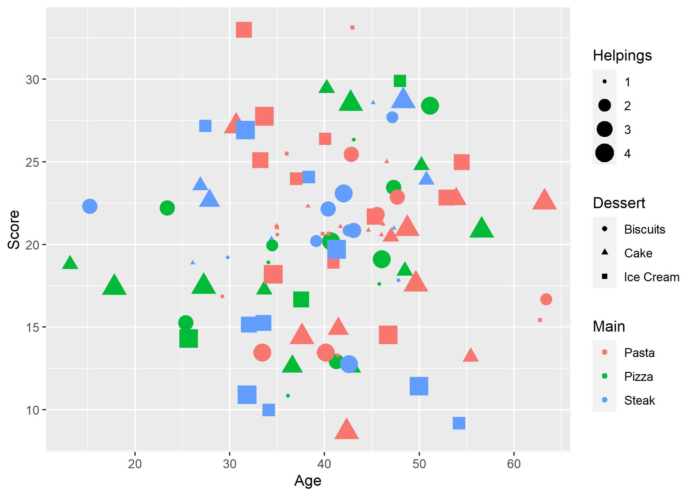

# How Do I Look?

One of the most pleasing packages that comes with the `tidyverse` is the `ggplot2` package. This is at the core of plotting within the `tidyverse`. As with anything else in R, there are other package that can plot that are built on top of the `ggplot2` package. Once we learn the core style of `ggplot2`, you'll be able to transfer that knowledge.

## The ggplot() function

Previously we made plots using the `plot()` function, which takes an `x` and `y` and plots them together. Pretty intuitive. For `ggplot()`, our data needs to be organised into a tibble (or a data.frame) for us to actually plot it. This is why we're going to need the `tibble()` function, because our data needs structure before we can `ggplot()` it.

The `ggplot()` function basically just starts us off. Like grabbing a blank canvas. We'll then add **layers** to our canvas using other functions. Try running `ggplot()` on it's own and you'll see that it clears the **Plots** tab in our **Viewer** pane.

## The aes() function

There are lots of different aspects of a plot that we can change and personalise. This includes the values that we're going to put along the x- and y-axis. In `ggplot2`, we call these things `aesthetics`. We use the `aes()` function to map variables in our dataset (a tibble or a data.frame) to these aesthetics:

```{r}
aes(Score_1,Score_2,col=Score_3)
```

Notice that we haven't provided any data to `aes()`. We've just provided it with some variable names (without quotes). When we *do* tell `ggplot2` what our data is, it will automatically piece it all together based on these mappings. Also note that `aes()` assumes the first two arguments are `x` and `y` (unless otherwise stated). Convenient.

Now, whenever we want to do something with our data in `ggplot2`, we use these `aesthetics`, rather than the original variable names.

## The geom_point() function

So now `ggplot2` knows what our variables are called, so let's tell it how we want to display our variables. The simplest plot we can do is a `geom_point()` plot, which gives us a scatter plot. Remember, we start with  blank canvas `ggplot()` and then add our `layers` to it.

`r set.seed(97310)`
```{r}
n <- 50
dat <- tibble(Score_1 = rnorm(n),Score_2 = rnorm(n), Score_3 = rnorm(n))

ggplot(dat,aes(Score_1,Score_2)) + 
  geom_point()
```

In this code, we defined our data and our aesthetics in the `ggplot()` function. This means that we're going to use the same data and aesthetics for each layer, but we can specify either the data or the aesthetics for an individual `layer`, and we can specify aesthetics separately.

```{r}
ggplot(aes(x=Score_1),data=dat) + 
  geom_point(aes(y=Score_2),col="red") + 
  geom_point(aes(y=Score_3),col="blue")

```

We can also define aesthetics to be separate from the data. In the above example, we defined `col` (or colour) to be a constant for each layer individually. Therefore, this is a static aesthetic (since it doesn't change) as opposed to a dynamic aesthetic (different for each data point).

## The geom_line() function

The previous function allowed us to plot a scatter plot. Nice and basic. Obviously, there are plenty of other kinds of plots we might want to create. The key aspects of these functions stays the same, but we can change what the type of plot is by changing what comes after the `geom_*`

```{r}
dat_lin <- tibble(Score_1 = seq(-3,3,length.out=20),
                  Score_2 = Score_1+rnorm(20,sd=0.3))

ggplot(aes(x=Score_1,y=Score_2),data=dat) +
  geom_point(col="red") +
  geom_line(data=dat_lin)
```

Notice that here, we have specified that the data in our `geom_line()` function is acutally going to come from a different dataset to our `geom_point()` function. By default, the functions will use the data and aesthetics defined in the `ggplot()` function, but we can override that if we want to add more to our plots.

It's also important to remember that `ggplot2` is adding the layers to our canvas *in order*, so sometimes we may end up with a layer being *over* another.

## The geom_histogram() function

If we have a single variable and we want to see it's distribution, the most common way to do this is through a histogram and, of course, `ggplot2` has a histogramming function:

```{r}
p <- ggplot(dat, aes(Score_1)) +
  geom_histogram(aes(y=..density..),binwidth=0.2,fill="red")

p
```

Note that here, we actually stored our plot as a *variable*, `p`. This can be useful if you want to experiment with different styles in your plot without having to re-write the whole `ggplot()` command. We also supplied the `x` aesthetic (`Score_1`), which is what we're counting and the `y=..density..` aesthetic. This tells `ggplot2` to show the density of the bins, rather than the count data.

We're also passing two other arguments to the `geom_histogram()` function. The `binwidth=0.2` tells `geom_histogram()` how wide we want each of these bins to be. There are various other ways we can define this and by default `geom_histogram()` will create 30 equally spaced bins. The `fill` argument tells `geom_histogram()` what colour to *fill* the bars in, whereas the `col` argument used earlier would tell `geom_histogram()` what colour to draw the border of our shapes.

## The geom_density() function

Creating a histogram is a nice way to see the distribution, but we can add a smoother version of a histogram using `geom_density()`, which essentially smooths out this distribution to look more like our classic density functions which define our pdfs:

```{r}
p + geom_density()
```

## The geom_bar() function

The histogram cuts our x-axis into bins and count how many values are in each of these bins. If we're using categorical variables, we need a bar chart rather than a histogram.

`r set.seed(34632)`
```{r}
c("dog","cat","fish") %>%
  sample(30,replace=T) %>%
  tibble(cat=.) %>%
  ggplot(aes(cat)) + 
  geom_bar(aes(fill=cat))
```

Notice that we have integrated our `ggplot()` function with the `%>%` to funnel our transformed dataset directly into our plot, and then added on the layers as normal. This is why `ggplot()` takes the dataset as it's first argument.

## Long vs Wide

In the previous lesson we briefly touched on the `gather()` and `spread()` functions as a way to convert between **Long** and **Wide** formatted data. Let's take a look at two different ways to plot the same data:

`r set.seed(4219)`
```{r}
n <- 20
dat_lin <- tibble(time = 1:n,
                  Score_1 =     time + rnorm(n),
                  Score_2 = 0.3*time + rnorm(n),
                  Score_3 = 1.2*time + rnorm(n,sd=0.3),
                  Score_4 = 0.5*time + rnorm(n,sd=0.3),
                  Score_5 =   2*time + rnorm(n,sd=0.3))

ggplot(dat_lin,aes(x=time)) +
  geom_line(aes(y=Score_1),col="black") +
  geom_line(aes(y=Score_2),col="red") +
  geom_line(aes(y=Score_3),col="blue") +
  geom_line(aes(y=Score_4),col="orange")+
  geom_line(aes(y=Score_5),col="purple")

```

Here, our data is in a **Wide** format, meaning we have a separate column for each of our variables. The code above works okay, but if we have a lot of these variables in our wide format, then we'd be typing the same code repeatedly and creating a new layer for each variable (and we made run out of colours to come up with!)

```{r}

dat_lin %>%
  gather(-time,key="Score.Num",value="Score") %>%
  ggplot(aes(x=time)) +
  geom_line(aes(y=Score,group=Score.Num,col=Score.Num))
```

This method bypassess the need to come up with our own colours for our lines (`ggplot2` has some built in methods of picking colours) and also provides a legend along the side to tel us what each colour means.

## The geom_ribbon() function

In statistics, we're never sure that an estimate is exact, and so a common thing that we would do is to estimate it within some sort of boundary. If we have these bounds, we can use them in a plot:

`r set.seed(11039)`
```{r}
dat <- tibble(time = 1:20,
              Score = time + rnorm(20),
              Error = runif(20,0,1))

dat %>%
  mutate(Upper = Score + Error,
         Lower = Score - Error) %>%
  ggplot(aes(x=time)) + 
  geom_line(aes(y=Score),col="red") + 
  geom_ribbon(aes(ymin=Lower,ymax=Upper),col=NA,fill="red",alpha=0.2)

```

In the above plot, we used a static aesthetic called `alpha`, this defines how transparent our ribbon is and means that we can still see the other layer below it (remember `ggplot2` plots the layers in order).

Worth noting that we don't necessarily have to define the confidence intervals before plotting the data. We can pass calculations as aesthetics.

```{r}
ggplot(dat,aes(x=time)) + 
  geom_line(aes(y=Score),col="red") + 
  geom_ribbon(aes(ymin=Score-Error,ymax=Score + Error),col=NA,fill="red",alpha=0.2)
```

## Zooming

By deafult, `ggplot2` will figure out what the range of values your data is using and create the plot accordingly to include all of your data. However, sometimes this is not idea

`r set.seed(73910)`
```{r}
n <- 30
dat <- tibble(time = 1:n,
              Score = rnorm(n))

#Let's deliberately add in an outlier
dat$Score[15] <- 100

p <- ggplot(dat,aes(time,Score)) +
  geom_line() 

p
```

See, all of the data is really clumped together and it makes it hard to see because of that one outlier, `ggplot` tries to plot everything. We can use `ylim()` or it's counterpart, `xlim()` to zoom in on the region that we only way to consider.

```{r}
p + ylim(-3,3)
```

This view creates a cut along our line. If we were plotting points, this would be fine or if we *did* want to omit the outlier, it would work okay. But what if we just want to zoom in, but keep the outlier off-screen? We use `coord_cartesian()` to do this.

```{r}
p + coord_cartesian(ylim=c(-3,3))
```

The graph is essentially the same, but we've zoomed in and the lines still all connect.

## Labelling

Up until now, we've been plotting pretty plain views of the data, however we'd usually want our plots to be clear about what they're showing:
`r set.seed(413430)`
```{r}
n <- 40
dat <- tibble(yr = 1970 + 1:n,
              v = rnorm(n))

p <- ggplot(dat,aes(yr,v)) + 
  geom_line()

p + labs(title="Change over time",
         subtitle = "Right Here",
         x = "Year",
         y = "Score")
```

## Other aesthetics

We mentioned briefly that we could change the colour of our points, either as a static change (everything in the layer is the same) or based on a group. There are a few other aesthetics we can personalise as we like:

`r set.seed(9320)`
```{r}
n <- 100
dat <- tibble(Main = sample(c("Pizza","Pasta","Steak"),n,replace=T),
              Dessert = sample(c("Ice Cream","Cake","Biscuits"),n,replace=T),
              Helpings = sample(4,n,replace=T),
              Age = rnorm(n,40,10),
              Score = rnorm(n,20,5))

p <- ggplot(dat) + 
  geom_point(aes(x=Age,y=Score,col=Main,shape=Dessert,size=Helpings))

p

```

## The ggsave() function

So, we've made our beautiful plot. What do we do with it now? We need to be able to save it! the `ggsave()` function does just that
```{r}
ggsave("MyPlot.jpg",p)
```

Here is the saved image:



When we save, we can either do it as default

