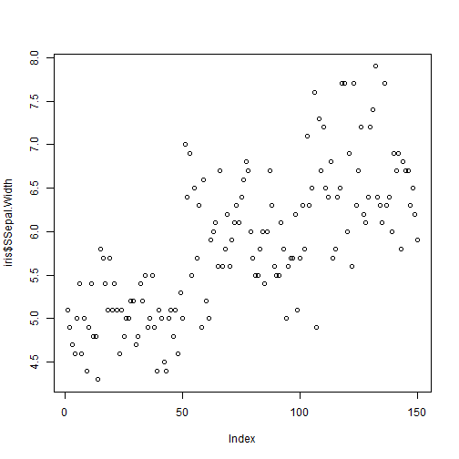
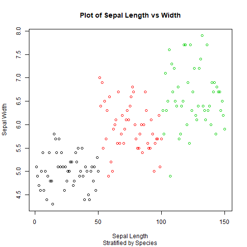
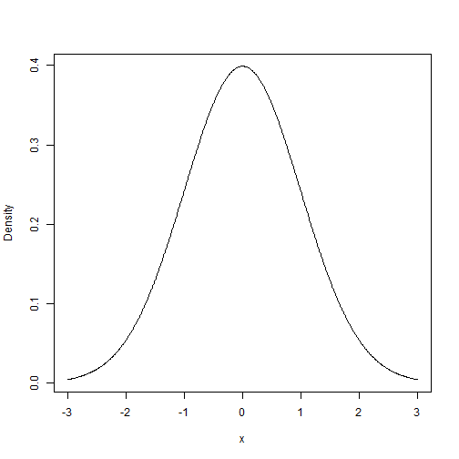
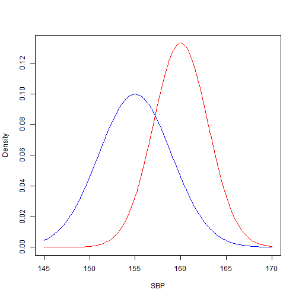
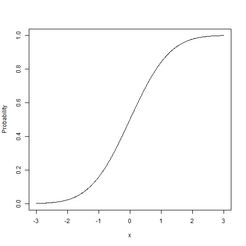
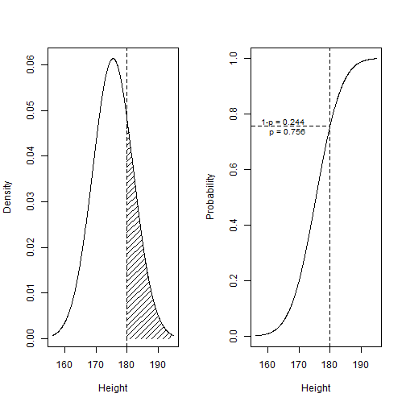
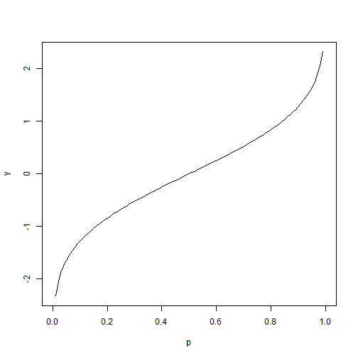
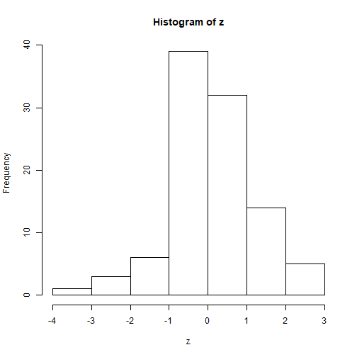
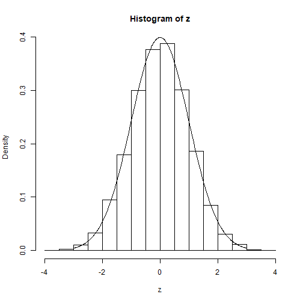
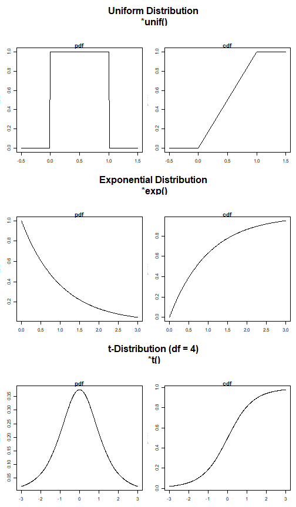

# Welcome {-}
<div style= "float:left;position:relative;padding-right:30px;">
{#id .class width=300}
</div>

Welcome to the Lecture Notes for the Current Semester's R Tutorial. Please use the links on the left to browse through the notes.

<!--chapter:end:index.rmd-->


# Introduction to R

## R & RStudio

### R
<div style= "float:left;position:relative;padding-right:10px;">
{#id .class width=80 height=80}
</div>

R is a programming language that is designed to work quickly and efficiently with large amounts of data, this is done through the unique way it processes this data. It is open source, meaning that other people from around the world can easily contribute code that you can use through add-ons, known as `packages`. Another reason for R's popularity is that it (and the applications that run it) are **free** and (perhaps because it is free) the support online (from other ordinary users) is incredibly helpful.


### RStudio
<div style= "float:right;position:relative;padding-left:10px;">
{#id .class width=80 height=80}
</div>

If you try to download R directly, you will also download a program called RGui. This is the default program for running R code. For what it does, RGui is *fine*. But we don't want *fine*, we want **GREAT**! So we're going to use another program called RStudio. RStudio organises your workspace a little bit better than the default RGui and allows for better interacticve help features which we'll discuss later. Below is an example of what RStudio should look like.

<center>
<div style= "position:relative;padding-bottom:30px;padding-top:30px;">
{#id .class width=80%}
</div>
</center>

The screenshow shows the four panes that we usually work with. Top-Left shows the **Script**, which is the code file we're currently working in. Code written here won't be run immediately, but it allows us to save code to be re-run later. Bottom-Left shows the **Console**, code written here *will* be run, so be careful what you type here. Top-Right is the **Workspace**, which shows the variables/data that RStudio is storing for us and that we can use. Bottom-Right shows the **Viewer**, which primarily displays Plots and Help. Of course there is a lot more going on here, but for the most part, these are the important bits.

Remember: R is the **language** and RStudio is the **application**, but you can't use RStudio without R! (That said, I'm probably going to use the two interchangeably throughout)

### Where to get them?
When you're using an LJMU computer, you can search for "RStudio" in the LJMU Application Player to download it. This course is designed for use with RStudio 64 (with the circular logo). Elsewhere, you can download it from their [webpage](https://rstudio.com/products/rstudio/download/#download). As mentioned above, RStudio is **free** and will automatically install R as well.

### First steps
When you first open RStudio, what you see won't be like the screenshot. That's because there is no **Script** open and so the **Console** fills the entire left side. It's also filled with some information regarding licencing and the version of R you are currently running. The first step in RStudio is to create a new script. Go to File > New File > R Script (or press Ctrl + Shift + N on Windows or Cmd + Shift N on Mac). The **Script** pane should now appear with a tab called "Untitled 1".


In the **Console** pane, type `2+2` and hit Enter.

```r
2+2
```

```
## [1] 4
```

RStudio just ran the code immediately. The `[1]` here just means that the `4` is the first result from what R has calculated (we'll get on to that in a bit). Next, with the Console still selected, press up and RStudio will recall the previously run line of code. and you can change the code and you run it again

```r
2+3
```

```
## [1] 5
```

This time, in the **Script** pane, type `pi+1`, hightlight it and press Ctrl + Enter (or Cmd + Enter on Mac). 

```r
pi+1
```

```
## [1] 4.141593
```
This will automatically transfer the code into the **Console** and run it. Importantly, however the code is still in the **Script** pane, ready to be edited and/or used again.


**Congratulations**! You just did some coding!

## Help
### Help Files

For any problem you might have, your first port of call in RStudio is the `?` symbol. R mostly works with **functions** (which we will get to prety soon), and so if you need help in RStudio, you can type a question mark followed by the name of that function and help will pop up in the **Viewer** pane

```
?mean
```

### Search

Next port of call should be Google/Ecosia/Bing or whatever your Search Engine of choice is. If you have a question that you need to know, type in "R" and then just *ask* that question to your search engine. I don't mean try to phrase it in a certain way, I mean write the question exactly how you would ask it!

<center>
<div style= "position:relative;padding-bottom:30px;padding-top:30px;">
{#id .class width=80%}
</div>
</center>

When you search for something, a lot of results will probably be tutorials on how to do what you're trying to do. If what you're asking is a common question, these will be good resources.


For more unusual questions, **Stack Exchange** is the most reliable forum for R answers. It is full of users who are more than willing to answer your difficult questions (some of them even enjoy it!)

### Ask

Surprisingly enough, Statisticians love Twitter. If you have a question, just post it with the [#RStats](https://twitter.com/hashtag/RStats) hashtag and you'll probably get some reasonable responses. Or tweet it with [#LJMU_MSIT](https://twitter.com/hashtag/LJMU_MSIT) and *I* will either reply or retweet it to more stats people.

Finally, the Maths, Stats & IT Team run regular Drop-In Sessions and One-To-Ones which you're more than welcome to come by to. Just check out the [Library Calendar](https://ljmu.libcal.com/calendar/?cid=4049&t=g&d=0000-00-00&cal=4049&ct=32020,32850,32086,32090) to find a suitable session.


Remember, never feel like you're asking a stupid question. If you don't know the answer, just ask!


## Vectorisation

### Vectors

In mathematics, a vector is usually a set of ordered numbers which can be used to represent a point in 2/3D space. However, R uses vectors in a slightly different manner to essentially mean a list of data (although a `list` is a different thing in R). I can create a vector in R by using the `c` *function* and passing some numbers as *arguments*, separated by a comma.

```r
c(1,2,3)
```

```
## [1] 1 2 3
```

I used a little bit of Jargon there, but to keep things clear. A **function** is a command that tells R to do *something* and an **argument** is the information or data you give to the function so it can do it's job. Sometimes functions don't need arguments:


```r
Sys.time()
```

```
## [1] "2020-04-09 10:43:15 BST"
```

And, a word of warning, R is **Case Sensitive**. This means you need to be careful that you use upper and lower case appropriately.


```r
sys.time()
```

```
## Error in sys.time(): could not find function "sys.time"
```

We've now created a vector of numbers but we've not done anything with these numbers. What is happening here:

```r
c(1,2,3) + 10
```

```
## [1] 11 12 13
```

In the jargon of R (and computer programming in general), the addition symbol (`+`) here is called an **operator**. Operators take something on the left and something on the right and do something with them. Here are several more and you should recognise most of them:
```{}
+ - * / < > ^ == != :
```

In order: Addition (`+`), Subtraction (`-`), Multiplication (`*`), Division (`/`), Less Than (`<`), Greater Than (`>`), Exponentiation (`^`), Equivalency (`==`) (i.e. are these two things the same?) and Non-Equivalency (`!=`) (are these two things different?). The last one, is probably new to you. the `:` operator works with numbers to create a vector that runs from the first number to the second and is very useful for quickly creating big vectors.


```r
1:100
```

```
##   [1]   1   2   3   4   5   6   7   8   9  10  11  12  13  14  15  16  17  18  19  20  21  22  23  24  25
##  [26]  26  27  28  29  30  31  32  33  34  35  36  37  38  39  40  41  42  43  44  45  46  47  48  49  50
##  [51]  51  52  53  54  55  56  57  58  59  60  61  62  63  64  65  66  67  68  69  70  71  72  73  74  75
##  [76]  76  77  78  79  80  81  82  83  84  85  86  87  88  89  90  91  92  93  94  95  96  97  98  99 100
```
This also demonstrates what the `[1]` meant earlier. The element next to it is the *first* element. The next row here, shows `[19]`, which means that `19` is the *nineteenth* element, and so on. This makes it easier, if you're dealing with large data, to pinpoint where something might be wrong. Try running the code `1:1000` (either in the **Console** or the **Script** pane).

What do you think is happening here?

```r
length(1:1000)
```

```
## [1] 1000
```

what happens if you run the code `length(1:(10^6))`? And what about `length(1:(10^15))`. Try 

```r
length(1:(10^16))
```

```
## Error in 1:(10^16): result would be too long a vector
```


R doesn't even try it. R knows its limits But it can make it up to 10<sup>15</sup>, which means that R created a vector that was 10<sup>15</sup> elements long before figuring out its length. And it did it really quickly (because R is good with vectors)

### Data Types

We've just learned about **Vectors** as lists<sup>(even though `list` means something else)</sup> of numbers. But Vectors can also be `character` vectors. Sometimes called `strings`, character vectors just means words:

```r
c("Hello","World")
```

```
## [1] "Hello" "World"
```

Another basic data type in R is the `logical`, which represents `TRUE` or `FALSE` values.

```r
c("red","blue","green","yellow") == "red"
```

```
## [1]  TRUE FALSE FALSE FALSE
```

Here, we created a vector of characters and then checked whether each of them (one-by-one) were equal to the character vector `"red"`. Again, however, remember that R is *Case Senstive*:

```r
"red" == "Red"
```

```
## [1] FALSE
```

We can also multiply `logical` values by `numeric` values (i.e. numbers) and R will interpret a `TRUE` as being 1 and a `FALSE` as being 0.

### Assignment
Consider the following line of code:


```r
length(c("Hello","World")) - 1
```

```
## [1] 1
```

There are many steps happening here. First,the `c` function took in the two arguments `"Hello"` and `"World"`, realised they were characters (rather than numbers), put them together into a vector (that's its job) and then passed that vector as a *single* argument to the `length` function. Finally, we subtracted `1` from the result.

Now consider the following line of code:

```r
x <- c("Hello","World")
length(x) - 1
```

```
## [1] 1
```
Much easier to read and follow. We created the vector in the same way, but then we used the `<-` operator to put it in a box called `x`. On the next line, we put that box into the `length` function, and then subtracted the 1. This *box* is called a variable, and if you run this line of code, you'll notice that the `x` variable now populated our **Workspace** pane in the Top-Right. The **Workspace** pane tells us the data type (`chr` is short for `character`) and we can tell that the length is 2 from the bit that says `[1:2]` (we'll unravel this soon, too).

Being able to assign variables is a kay part of using R (and again, programming in general). Once these variables have been assigned, we can use them again and again, and re-assign them as and when we need, and even use them to re-assign themselves!


```r
x <- 2
x + 2
```

```
## [1] 4
```

```r
x + 3
```

```
## [1] 5
```

```r
x <- x + 1
x
```

```
## [1] 3
```
### Subsetting

Now, `x` in our **Workspace** pane is just a single number (not a vector). But we can obviously change that

```r
x <- c(2,4,6,8,10)
```
We're once again told it's data type (this time its an `int`), and its length is 5 from the `[1:5]`. When we're working with vectors, sometimes we need to grab out just some of the elements and not all of them. For this, we use **extraction**. If we want to pull out the third element of a vector, we enclose that number in square brackets, `[` and `]`, to tell R that we are extracting data from a vector: `x[3]`. We can also pass a vector into the subsetting to grab more than one element:

```r
x[c(1,2,3)]
```

```
## [1] 2 4 6
```
And, since we can pass in a vector, think about what the following does.

```r
x[1:3]
```

```
## [1] 2 4 6
```

The next easiest way to subset is to use a `logical` vector that is the same length as the vector we are subsetting, and R will return any element which is `TRUE` and ignore elements which are `FALSE`.

```r
x[c(T,T,F,F,T)]
```

```
## [1]  2  4 10
```

```r
y <- c("red","blue","yellow","green","red")
x[y=="red"]
```

```
## [1]  2 10
```

Finally, we can also subset to remove elements we're not interested in

```r
x[-3]
```

```
## [1]  2  4  8 10
```

```r
x[-c(2,3)]
```

```
## [1]  2  8 10
```

Assignment and Subsetting can also be combined to change certain elements in our vector

```r
x[3] <- 2
x
```

```
## [1]  2  4  2  8 10
```

```r
x[4:5] <- 0
x
```

```
## [1] 2 4 2 0 0
```

If we have a patrticularly large vector, we can also look at just the first 6 values, by using the function `head()` (or conversely, `tails()` to show us the last 6), as we'll see in the next section.

Do you see what the `[1:5]` means in the **Workspace** pane? The `1:5` is the possible values that we can subset `x` with.


## Statistics

### Data

Now that we have the basics, we can move onto some statistical work using data. Normally, you would use a function such as `read.csv()` to read in our data. This function can read in data that is formatted as a csv file (or comma-separated). There are also ways to import more complicated data, such as from excel, but these don't come built-in with R (we need additional stuff called `packages` to load other data).

An important note when loading data using `read.csv()` or a similar function is that the file directory needs to use forward slashes (`/`) rather than backward slashes (`\`). Basically, copy the folder directory, but replace the slashes:


```r
dat <- read.csv("M:\Documents\My Data.csv") # This line won't work
dat <- read.csv("M:/Documents/My Data.csv") # This works!
```

That's how you get *your* data into R. Today, we're going to begin by loading up a built in dataset, called `iris`, which is a dataset containing data about flowers.

```r
data("iris")
head(iris)
```

```
##   Sepal.Length Sepal.Width Petal.Length Petal.Width Species
## 1          5.1         3.5          1.4         0.2  setosa
## 2          4.9         3.0          1.4         0.2  setosa
## 3          4.7         3.2          1.3         0.2  setosa
## 4          4.6         3.1          1.5         0.2  setosa
## 5          5.0         3.6          1.4         0.2  setosa
## 6          5.4         3.9          1.7         0.4  setosa
```
The function `data()` can be used to load up a Built-in datasets (useful for examples and practising!). As previously said, `head()` now displays the first 6 *rows* of our data, which is a table (known in R as a `data.frame`).

Double click on `iris` in the **Workspace** and a new tab will open up in place of the **Script** pane. This shows the full table and allows us to scroll. There are five variables in `iris`: `Sepal.Length`, `Sepal.Width`, `Petal.Length`, `Petal.Width` and `Species` (note the capitalisation!).

Similar to a vector, we can subset in a `data.frame` using the square brackets, however since `iris` is a table, R needs two values, one for the *row* and a second for the *column*, separated by a comma (again, we can extract multiple rows/columns by using vectors)

```r
iris[2,3] #Returns the value in the second row and the third column
```

```
## [1] 1.4
```

```r
iris[1:10,1:3] #Returns the values in the first ten rows and the first three columns
```

```
##    Sepal.Length Sepal.Width Petal.Length
## 1           5.1         3.5          1.4
## 2           4.9         3.0          1.4
## 3           4.7         3.2          1.3
## 4           4.6         3.1          1.5
## 5           5.0         3.6          1.4
## 6           5.4         3.9          1.7
## 7           4.6         3.4          1.4
## 8           5.0         3.4          1.5
## 9           4.4         2.9          1.4
## 10          4.9         3.1          1.5
```

```r
iris[1:5,c(3,4,5)] #Returns the first five rows and the 3rd, 4th and 5th columns
```

```
##   Petal.Length Petal.Width Species
## 1          1.4         0.2  setosa
## 2          1.4         0.2  setosa
## 3          1.3         0.2  setosa
## 4          1.5         0.2  setosa
## 5          1.4         0.2  setosa
```

The way R structures `data.frames` is that each variable within the `data.frame` is it's own vector of values with the restriction that all the vectors have to be the same length, i.e. the number of rows in the table. Which means, we can pull vectors out using the `$` operator:

```r
iris$Sepal.Length #Notice that RStudio pops up with the available variable names here
```

```
##   [1] 5.1 4.9 4.7 4.6 5.0 5.4 4.6 5.0 4.4 4.9 5.4 4.8 4.8 4.3 5.8 5.7 5.4 5.1 5.7 5.1 5.4 5.1 4.6 5.1 4.8
##  [26] 5.0 5.0 5.2 5.2 4.7 4.8 5.4 5.2 5.5 4.9 5.0 5.5 4.9 4.4 5.1 5.0 4.5 4.4 5.0 5.1 4.8 5.1 4.6 5.3 5.0
##  [51] 7.0 6.4 6.9 5.5 6.5 5.7 6.3 4.9 6.6 5.2 5.0 5.9 6.0 6.1 5.6 6.7 5.6 5.8 6.2 5.6 5.9 6.1 6.3 6.1 6.4
##  [76] 6.6 6.8 6.7 6.0 5.7 5.5 5.5 5.8 6.0 5.4 6.0 6.7 6.3 5.6 5.5 5.5 6.1 5.8 5.0 5.6 5.7 5.7 6.2 5.1 5.7
## [101] 6.3 5.8 7.1 6.3 6.5 7.6 4.9 7.3 6.7 7.2 6.5 6.4 6.8 5.7 5.8 6.4 6.5 7.7 7.7 6.0 6.9 5.6 7.7 6.3 6.7
## [126] 7.2 6.2 6.1 6.4 7.2 7.4 7.9 6.4 6.3 6.1 7.7 6.3 6.4 6.0 6.9 6.7 6.9 5.8 6.8 6.7 6.7 6.3 6.5 6.2 5.9
```
And these vectors can be used in the exact same way as other vectors, e.g

```r
iris$Sepal.Width[1:15]
```

```
##  [1] 3.5 3.0 3.2 3.1 3.6 3.9 3.4 3.4 2.9 3.1 3.7 3.4 3.0 3.0 4.0
```

As previoiusly, we can also edit individual values (known as *cells*) within a dataset using the subsetting and assignment.

### Describing our data
Here are a few functions that can be useful for describing your data:

```r
mean(iris$Sepal.Length) #Gives the arithmetic mean of the variable Sepal.Length within the data.frame iris
```

```
## [1] 5.843333
```

```r
sd(iris$Sepal.Width) #Standard Deviation of the variable
```

```
## [1] 0.4358663
```

```r
table(iris$Species) #Provides a count of each unique value of the variable
```

```
## 
##     setosa versicolor  virginica 
##         50         50         50
```

```r
range(iris$Petal.Length) #Gets the minimum and maximum values, these can also be extracted using min() and max()
```

```
## [1] 1.0 6.9
```
If we want to find out the median and/or percentiles of a variable we use the `quantile()` function, and we can specify which percentiles we want to find in the vector. We do this by specifying the percentiles as decimal values (i.e. between 0 and 1) in another vector and pass *both* arguments to the function. Once again, remember we separate arguments by a comma.

```r
Quantiles <- c(0.05,0.5,0.95)
quantile(iris$Petal.Width, Quantiles)
```

```
##  5% 50% 95% 
## 0.2 1.3 2.3
```
We did not need to define `Quantiles` beforehand here, but it certainly makes the code look a little neater than this: `quantiles(iris$Petal.Width,c(0.05,0.5,0.95))`.

We can also combine subsetting to pull out descriptive statistics based on pre-requisites. What does this do?

```r
mean(iris$Sepal.Length[iris$Species == "setosa"])
```

```
## [1] 5.006
```

From R's perspective:

  * Create a `logical` vector that is the same length as the vector `iris$Species` (i.e. same as the number of rows in the table), to indicate whether `iris$Species == "setosa"`
  * Pull out the subset of `iris$Sepal.Length` such that the previous vector is `TRUE`
  * Calculate the mean of this vector.

R works from the inside outwards when it comes to functions like this. Not the most legible way to understand the code afterwards (but we'll learn how to fix this next week!)

### Plotting
The basic function for plotting in R is the `plot()` function, and is used very intuitively for scatter plots:

```r
plot(iris$Sepal.Length,iris$SSepal.Width)
```



However, this is pretty boring. Let's add some colour and give appropriate labels

```r
plot(x = iris$Sepal.Length,
     y = iris$SSepal.Width,
     col = iris$Species,
     main = "Plot of Sepal Length vs Width",
     sub = "Stratified by Species",
     xlab = "Sepal Length",
     ylab = "Sepal Width",
     )
```



Here, we changed the plot to use the variable `Species` as an indicator of which colur to use for each point. We could have just used `col="red"` to tell R to plot them *all* red, but that's not as useful to distinguish!

We've done something new here, we supplied our arguments to the function as a *named* argument. This is because not all of these arguments are needed (see the previous one). If we don't name them, R assumes the first argument is `x` and the second is `y` (which is a good assumption to make). However, since they're not needed, we need to tell R which is which (it can't rely on them being supplied in the same order everytime). If we don't specify them, R will choose default values, which can be seen in the help file (`?plot`).

## Probabilities

### Data Distributions
Now that we can plot, it means we can visualise a key aspect of statistics: the probability density function (pdf) and the cumulative density function (cdf) of a probability distribution.To demonstrate, I'm going to use the *Normal* distribution.

The Normal distribution is one of the most commonly used distributions due to its symmetry and the fact that many natural variables can be modelled by it. The *Standard Normal* distribution is when the values have been standardised so that the mean is 0 and the sd is 1.

#### Density Function


```r
x <- seq(-3,3,0.01) #Create a vector form -3 to 3 with steps of 0.01
y <- dnorm(x, mean=0, sd=1) #Here is the new function
plot(x, y, type="l",ylab="Density") # The argument type = "l" means we want a line plot
```



The function `dnorm` is the probability density function (pdf) for the Normal distribution, usually written as $f(x)$. Higher density means more values are clustered around there and a lower density means there are less. the two arguments, `mean` and `sd` can be defined to match our data. For the Standard Normal, the pdf is defined by this nasty looking formula:
$$
f(x) = \frac{1}{\sqrt{2\pi}}e^{-\frac{1}{2}x^2}
$$

Let's say we have a clinical trial with two arms; a control arm and a treatment arm. The treatment arm recieves a drug that *may* be able to reduce systolic blood pressure (SBP). After the trial is over, we are told that for the control arm, the mean SBP is 160 with an sd of 3 and the treatment arm has an SBP of 155 with an sd of 4. Assuming they are Normally distributed (a fair assumption if we have enough patients), then we can plot the density of the two distributions on the same plot

```r
x <- seq(145, 170, 0.1) #Broad range of values to cover both groups
control.y <- dnorm(x, mean = 160, sd = 3) #Get the y values for the control arm
treat.y <- dnorm(x, mean = 155, sd = 4) #Get the y values for the treatment arm

plot(x,control.y,col="red",type="l",ylab="Density",xlab="SBP") #Remember what all these arguments do?
lines(x,treat.y,col="blue") #the lines() function *adds* a line to a previous plot
```



Loooking at the two plots, there is a lot of overlap so it would be difficult to say that this drug works. What happens if you change the mean or sd for either of the arms?

#### Probability Function


```r
x <- seq(-3,3,0.01)
y <- pnorm(x, mean=0, sd=1)
plot(x, y, type="l",ylab="Probability")
```



The function `pnorm` is the cumulative density function (cdf), usually written as $F(x)$. It is defined as the area under the pdf up to the value (i.e. its integral). It is used to find the probability that something is less than that value (assuming it follows a Normal Distribution).
$$
F(x) = \int_{-\infty}^x f(u) \;\textrm{d}u = \textrm{Prob}\left(X < x\right)
$$

This can answer questions such as: "If we assume the height of males at a university follows a Normal distribution with a mean of 175.5cm and a standard deviation of 6.5cm. What is the probability that a male student chosen at random is taller than 180cm?"


```r
p <- pnorm(180, mean = 175.5, sd = 6.5) #This is the probability that a student is *shorter* than 180cm
1 - p #The probability that they are *taller* than 180cm
```

```
## [1] 0.2443721
```




#### Quantile Function


```r
p <- seq(0,1,0.01) #This time, we need the input to be between 0 and 1
y <- qnorm(p,mean = 0, sd = 1)
plot(p,y,type="l")
```



The function `qnorm()` is the inverse of the `pnorm()` function. For a given probability, it can provide the associated value. From the previous example, what height are 95% of the students shorter than?

```r
p <- 0.95
qnorm(p, mean = 175.5, sd = 6.5)
```

```
## [1] 186.1915
```

So 95% of the male students in the school are shorter than 186.2cm.

#### Random Function

```r
z <- rnorm(100, mean = 0, sd = 1)
head(z)
```

```
## [1]  1.11150606 -0.14257569  0.01367484 -0.23031054 -0.51659945 -0.22691460
```

If you were to print out the `z` variable, you'd see 100 random numbers. The first argument we pass to the function `rnorm()` tells it how many random numbers to generate. These random numbers have been drawn from the Standard Normal distribution and so they will follow that distribution. We can see this with the following plot:

```r
hist(z)
```


This histogram shows where all the values in the data in `z` lie. We group them into bins and then count how many are in each bin.

This histogram should roughly look like the pdf of the distribution. However, due to the random nature and the fact that there are only 100, it's not very close to it's underlying distribution. If we increase the number of random numbers to 10,000, it'll look closer.


```r
z <- rnorm(10000) #This time, we're not specifying the mean or sd for either rnorm or dnorm
x <- seq(-3,3,0.01)
y <- dnorm(x) # By default, R will use mean = 0 and sd = 1.
hist(z, probability = T) #This tells R that we want the probability of each bin, rather than the count (i.e. count/total)
lines(x,y)
```



##### Other Distributions

So far, for this section, we've used the Normal distribution. However, there is a whole bunch of other distributions that we could use, and they all follow the same formatting style:

* `dxxxx(x,...)` gives the probability density function of the distribution at `x`
* `pxxxx(x,...)` gives the cumulative density function of the distribution at `x`
* `qxxxx(p,...)` gives the inverse of the cdf of the distribution at `p`
* `rxxxx(n,...)` generates `n` random numbers that follow the distribution

A few examples can be seen in the below plots:


<!--chapter:end:01_Lesson_One.rmd-->


# Tidyverse for Tidy Data

## Packages

R is designed to be a **modular** approach to statistical analysis and is **open-source** and allows the addition of **packages**. This means that the version of R you download is the basic version of it and we can download **packages** which contian more advanced functions. Think of it like DLC, but for statistics (and much like R it is still free!) These packages are built by other R users and can be downloaded from a repository called **CRAN** (Comprehensive R Archive Network).

### Installing packages

The first package we're going to download and install is the `tidyverse` package (which actually imports/installs a bunch of other packages).

The command to install a new packages is:

```
install.packages("tidyverse")
```

This function will search **CRAN** for the package called `"tidyverse"` and install it into our own package repository. Note that this needs to be in quotes as this is a `string` that R will search for. It also downloads and installs all the other packages that `tidyverse` uses. As it's installing, you'll see it run through all these packages (e.g. `broom`, `ggplot2`,`tidyr`), we'll get to these later.


If you're running this on your home computer and have full admin rights, then this installation should go fine (it just might take a while). However if you don't have full admin rights, then you might need to use the `lock=F` argument like so: `install.packages("tidyverse",lock=F)`, for example on a university computer you need to install packages this way. If the installation fails, try this way.


You can see the currently installed packages inthe **Viewer** pane under the Packages tab. If you click on the name of a package in here, it will bring up a Help file (still in the **Viewer** pane) for that package, including a list of functions contained in that package (which link to their Help Files). Some packages include links to vignettes/documentation regarding the package.

### Documentation

As well as storing the actual package files, CRAN also stores documentation about the package. This includes the Help files that get installed along with the packages. CRAN homepages for packages are standardised and all look the same with (roughly) the same information.

Let's have a look at the CRAN page for the [tidyverse](https://cran.r-project.org/web/packages/tidyverse/).

Most of what we see here is for fairly advanced R users, so we're going to ignore a lot of it (until you get better). At the top, you can see the name of the package and a quick blurb about what it's for. There are also a bunch of links to other packages that the current package uses. Under the Downloads heading, you can see the **Reference manual** and the **Vignettes**.

The **Reference manual** for a package contains a list of all of the functions that are in that package, and information about their use. This information is the *same* information that is contained in the `?` Help files that is downloaded into R. This can be useful if you can't remember the name of a function, but you know it's in a certain package.

The **Vignettes** are more of a user guide. They're usually written by the package author and contains information on how to *use* the package. Kind of like an instruction manual, whereas the reference manual is more like the glossary. Packages don't always have vignettes, but when they do, I highly recomend reading them.

### Loading packages

So, we've installed a package, but we're not actually using it. Once a package has been *installed* it is stored on our system and we only need to do this once. But, we also need to load the package into our current R session. (Note that this time, we don't need quotation marks)


We now have access to all of the functions contained within the core bundle of `tidyverse` packages (listed in the console under `Attaching packages`. This means that by installing and loading the `tidyverse` package, we've actually installed and loaded these other packages (e.g. `ggplot2` and `dplyr`). Let's get started!

## The Pipe

One of the most important changes that comes with the `tidyverse` is the addition of the **Pipe**: `%>%`. It's a new operator that comes with the `dplyr` package (originally from the `magrittr` pckage) and it allows us to completely change how we use functions. It can make our code much easier to read, particularly when writing complicated series of functions. For example:

```r
#Written as single line:
log(sqrt(sum(runif(20))))


#Spread over multiple lines
x <- 20
x <- runif(x)
x <- sum(x)
x <- sqrt(x)
x <- log(x)
x

#Written with pipes:
20 %>%
  runif() %>%
  sum() %>%
  sqrt() %>%
  log()
```

All three of thes examples perform the same actions in the same order. But that first line is really difficult to read. It's hard to see what functions are happening and which brackets are associated with which function. If we wanted to add 3 after the `sum()` function, it would be hard to see where to put it.

In the single line version, we are working from the inside out. This gets easier to read in the version where we spread it across multiple lines since what we're doing is now in order. But this is prone to mistakes. What if we type `z` instead of `x` in a function call or an assignment call? The piped version gets rid of this risk and duplicated code (`x <-` on every line). I've chosen to spread my command over multiple lines to make it easier to read and to indent each new line (RStudio actually does this automatically for you), this makes my code look neater and much easier to read.

What the pipe does is allow us to *pipe* our answer into the next function as the first argument. We can then chain them together as above to make things much easier to read. This changes our syntax a little bit. The following lines perform the same thing:
```
f(a,b,c,d)
a %>% f(b,c,d)
```

And with chaining:
```
f(g(a,b),c,d)
a %>% 
  g(b) %>% 
  f(c,d)
```

If your function only takes a single argument, then you don't even need to include the brackets:

```r
20 %>%
  runif %>%
  sum %>%
  sqrt %>%
  log
```

```
## [1] 1.15144
```


The shortcut to quickly enter this in RStudio is Ctrl/Cmd + Alt + M

## Loading Data

I've uploaded a [messy dataset](https://raw.githubusercontent.com/MyKo101/MyKo101.github.io/master/Tutorials/LJMU_R/data/data_anthro.csv) online for us to use today. Right click the link and then download the file. Save it somewhere useful (maybe in a new folder).

In R (as well as many programming languages), we have something called the *working directory*. We can see this if we click on the Files tab in the **Viewer** pane (bottom right). This shows us all the files in our current directory (note, this might not be our working directory if we've clicked around a bit).

We can find out our working directory by using the command `getwd()` and we can change it using the `setwd()` command. It can be tricky to remember what the directory were trying to find its, so we can use a file explorer window to find it. In the top menu, click Session >  Set Working Directory > Choose Directory (or press Ctrl/Cmd + Shift + H). Find the folder where you've just saved the file and set it as our working directory.

You'll notice that R Studio actually sent the `setwd()` command to the **Console** for us anyway. If you want, you can copy and paste that into your script for use later (just remember to remove the `>` symbol or it won't run from the Script).

If you didn't want to download the file, you can also load it straight from the web:


```r
dat <- read_csv("https://raw.githubusercontent.com/MyKo101/MyKo101.github.io/master/Tutorials/LJMU_R/data/data_anthro.csv")
```

```
## Error in open.connection(con, "rb"): HTTP error 404.
```
This `read_csv()` function is contained in the `readr` package. There is a built in function in R that allows us to bring in csv files, but it's messier. We're in the tidyverse now!

This has given a bit of an output. `read_csv` tries to guess what data types columns/variables within this dataset are. We can suppress this message with the argument `col_types = col()`, or we can define what we want them to be by passing the data types as a vector (d=double, c=character,l=logical) `col_types=c("c","c","c","c","c")`.

Let's have a look at this data. Previously, we needed to use the `head()` function to just look at the top few rows. But that was when we were using  `data.frame` structure from the basic R package. `read_csv()` loads the data and stores it in a `tibble` format. This is essentially the same as a `data.frame` (and can be used in the same way), but provides a bit more information and consistency and only prints the first few rows:

```r
dat
```

```
## Error in eval(expr, envir, enclos): object 'dat' not found
```


